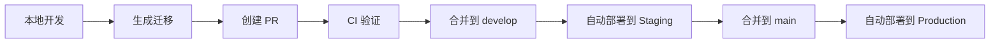

# GitHub Actions 自动化部署实现总结

## 📋 完成的任务

### ✅ 1. 创建 GitHub Actions 工作流文件

#### CI 验证工作流 (`.github/workflows/ci.yml`)

- **触发条件**: Pull Request 到 `develop` 或 `main` 分支
- **功能**: 本地验证迁移是否能正常应用
- **特点**:
  - 启动 Supabase 本地环境
  - 执行 `supabase db reset` 验证迁移
  - 自动清理环境

#### Staging 部署工作流 (`.github/workflows/deploy-staging.yml`)

- **触发条件**: 代码推送到 `develop` 分支
- **功能**: 自动部署到 Staging 环境
- **特点**:
  - 使用 `SUPABASE_ACCESS_TOKEN` 进行认证
  - 连接到 Staging 项目
  - 执行 `supabase db push` 部署迁移

#### Production 部署工作流 (`.github/workflows/deploy-production.yml`)

- **触发条件**: 代码推送到 `main` 分支
- **功能**: 自动部署到 Production 环境
- **特点**:
  - 使用生产环境凭据
  - 安全的部署流程
  - 部署后验证

### ✅ 2. 创建配置和文档

#### 详细设置指南 (`GITHUB_ACTIONS_SETUP_GUIDE.md`)

- 完整的 GitHub Secrets 配置说明
- 分支策略建议
- 安全注意事项
- 故障排除指南
- 高级配置选项

#### 快速开始指南 (`GITHUB_ACTIONS_QUICKSTART.md`)

- 5分钟快速设置
- 简化的操作步骤
- 关键信息汇总

#### 自动化脚本

- `scripts/setup-github-actions.sh` - 交互式设置脚本
- `scripts/verify-github-actions-setup.js` - 配置验证脚本

## 🔧 技术实现细节

### 工作流配置

- 使用 `supabase/setup-cli@v1` 官方 Action
- 支持 `workflow_dispatch` 手动触发
- 环境变量安全配置
- 错误处理和清理机制

### 安全考虑

- 所有敏感信息通过 GitHub Secrets 管理
- 使用 Supabase 官方推荐的认证方式
- 最小权限原则

### 部署策略

- **CI**: 本地验证，确保迁移语法正确
- **Staging**: 自动部署到测试环境
- **Production**: 自动部署到生产环境

## 📊 部署流程



## 🎯 使用说明

### 1. 初始设置

```bash
# 运行自动设置脚本
./scripts/setup-github-actions.sh

# 或手动验证配置
node scripts/verify-github-actions-setup.js
```

### 2. 日常开发流程

1. 从 `develop` 创建功能分支
2. 开发并生成迁移文件
3. 创建 PR 到 `develop` 分支
4. CI 自动验证迁移
5. 合并后自动部署到 Staging
6. 测试通过后合并到 `main`
7. 自动部署到 Production

### 3. 监控和维护

- 查看 GitHub Actions 运行状态
- 监控部署日志
- 定期更新 Supabase CLI 版本

## 🔍 验证清单

- [ ] GitHub Secrets 已正确设置（5个变量）
- [ ] Supabase CLI 已安装并配置
- [ ] 本地环境可以正常启动和重置
- [ ] 创建测试 PR 验证 CI 工作流
- [ ] 测试 Staging 部署流程
- [ ] 测试 Production 部署流程

## 📚 相关文档

- `GITHUB_ACTIONS_SETUP_GUIDE.md` - 详细设置指南
- `GITHUB_ACTIONS_QUICKSTART.md` - 快速开始指南
- [Supabase CLI 文档](https://supabase.com/docs/guides/cli)
- [GitHub Actions 文档](https://docs.github.com/en/actions)

## 🎉 总结

已成功实现完整的 GitHub Actions 自动化部署流程，包括：

1. **CI/CD 管道**: 从代码提交到生产部署的完整自动化
2. **环境隔离**: Staging 和 Production 环境的独立部署
3. **安全配置**: 使用 GitHub Secrets 管理敏感信息
4. **文档完善**: 提供详细的设置和使用指南
5. **工具支持**: 自动化脚本和验证工具

现在您的项目已经具备了企业级的自动化部署能力，可以确保数据库迁移的安全、可靠和自动化部署。
